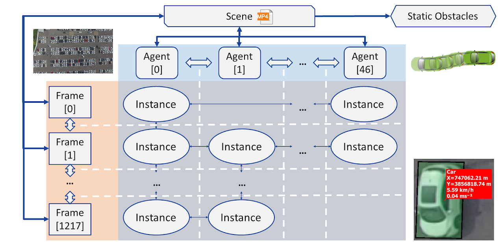

# avp-prediction-decision-planning

# 1.数据集
https://sites.google.com/berkeley.edu/dlp-dataset


## 组件定义

1. **场景 (Scene)**
   - 代表一个连续的视频录制。
   - 包含指向该录制中的所有帧、代理和障碍物的指针。

2. **帧 (Frame)**
   - 录制中的一个离散时间步。
   - 包含在这个时间步可见的所有实例列表。
   - 指向前一帧和后一帧。

3. **代理 (Agent)**
   - 在场景中移动的对象。
   - 包含对象的尺寸、类型和轨迹（由实例列表构成）。

4. **实例 (Instance)**
   - 代理在某个时间步的状态。
   - 包括位置、方向、速度和加速度。
   - 指向代理轨迹中的前一个和后一个实例。

5. **障碍物 (Obstacle)**
   - 在录制中从未移动过的车辆。

## 数据集统计

- **场景数**：30
- **帧数**：317,873
- **代理数**：5,188
- **实例数**：15,383,737

## 数据关系图
### 场景 (Scene)

- 包含多个帧 (Frame)
- 包含多个代理 (Agent)
- 包含多个障碍物 (Obstacle)
### 帧 (Frame)

- 包含在这个时间步可见的实例 (Instance)
- 有前一帧和后一帧的关系
### 代理 (Agent)

- 包含在不同时间步的多个实例 (Instance)
- 每个实例表示代理在某个时间步的状态
### 实例 (Instance)

- 关联代理 (Agent)
- 有前一个实例和后一个实例的关系
### 障碍物 (Obstacle)

- 仅在场景中静止不动
### 实例和帧的区别
### 帧 (Frame)

- 定义：帧是视频录制中的一个离散时间步。
- 内容：每一帧包含在该时间步可见的所有实例（即所有在该时间步出现的代理的状态）。
- 时间顺序：帧是按时间顺序排列的，前后帧之间有明确的时间关系。
- 作用：表示整个场景在某个具体时间点的状态，是一个快照，捕捉该时刻所有可见对象的位置、速度、加速度等信息。
### 实例 (Instance)

- 定义：实例是某个代理在某一帧中的状态。
- 内容：包括代理在该时间步的具体属性，如位置、方向、速度和加速度。
- 关联：实例与帧关联，每个实例都属于一个特定的帧。同时，实例也与代理关联，表示某个代理在该时间步的状态。
- 作用：用于跟踪单个代理在不同时间步的状态变化，了解某个代理的运动轨迹和动态特性。

## json举例

### agents
```
"1475e8ce201f188c544cbfa08862d5871ce0b82e": {
    "agent_token": "1475e8ce201f188c544cbfa08862d5871ce0b82e",
    "scene_token": "945381662bb4fd1e2cab8c9a1bd0efd246e6a627",
    "type": "Pedestrian",
    "size": [0.8333, 0.8333],
    "first_instance": "bc7c447a163cf8a5145fed3140d8ad4ea910f29c",
    "last_instance": "19fb34c9937cafa81c7f1a098f489daf50a43207"
  },
  "bb5aef009e46a73ed6169e4a1968ed9a4713c0f1": {
    "agent_token": "bb5aef009e46a73ed6169e4a1968ed9a4713c0f1",
    "scene_token": "945381662bb4fd1e2cab8c9a1bd0efd246e6a627",
    "type": "Car",
    "size": [4.7691, 2.0088],
    "first_instance": "0ef4e7df25bdc57bbfe6c0b61fce8a48ffb63d86",
    "last_instance": "bb2100e183d3ad51d0c617d7a209f85571041551"
  },
```

first_instance和last_instance是实例的标识符，表示代理在录制中的起始和结束位置，即出现的生命周期。可以去instances.json中查看实例信息。
- agent_token: 代理的唯一标识符。
- scene_token: 代理所在场景的唯一标识符。
- type: 代理的类型（例如，"Pedestrian" 表示行人，"Car" 表示汽车）。
- size: 代理的尺寸（例如，[长度, 宽度]）。
- first_instance: 代理的第一个实例的唯一标识符。
- last_instance: 代理的最后一个实例的唯一标识符。


### instances

```
"cdbcb80cb0e043477a7154afcf4b6c79f814fefa": {
    "instance_token": "cdbcb80cb0e043477a7154afcf4b6c79f814fefa",
    "agent_token": "07b280ebdb82a9d38ba9807130451c5575a7fba7",
    "frame_token": "9b83045c9c4c4d1939ba04b6811b69d58bb76e21",
    "coords": [116.68999999994412, 21.729999999981374],
    "heading": -1.579892653589793,
    "speed": 0.21,
    "acceleration": [0.0373, 0.0048],
    "mode": "",
    "prev": "",
    "next": "f226a357ce53acb296c292f1aff375f850c66c19"
  },
  "f226a357ce53acb296c292f1aff375f850c66c19": {
    "instance_token": "f226a357ce53acb296c292f1aff375f850c66c19",
    "agent_token": "07b280ebdb82a9d38ba9807130451c5575a7fba7",
    "frame_token": "8c97117cc3cdacad95ec28eb1d6c48a36f5bfd4f",
    "coords": [116.69999999995343, 21.72000000020489],
    "heading": -1.5780926535897932,
    "speed": 0.21,
    "acceleration": [0.0445, -0.0013],
    "mode": "",
    "prev": "cdbcb80cb0e043477a7154afcf4b6c79f814fefa",
    "next": "b855cd470df90578aefbabbe33a87c8469c7e5e9"
  },
```

- instance_token: 实例的唯一标识符。
- agent_token: 实例所属代理的唯一标识符。多个实例可能共享同一个代理标识符，表示它们属于同一个代理。
- frame_token: 实例所在帧的唯一标识符。多个实例可能共享同一个帧标识符，表示它们位于同一帧中。
- coords: 实例在当前帧中的坐标。
- heading: 实例的朝向（以弧度表示）。
- speed: 实例的速度。
- acceleration: 实例的加速度（由两个分量构成的数组）。
- mode: 实例的模式（在这个数据中为空字符串）。
- prev: 前一个实例的标识符。通过 prev 和 next 字段，我们可以追踪代理的运动轨迹，并分析其位置、速度和加速度的变化
- next: 后一个实例的标识符。

### Obstacles
```
"eb0fb143c4d9a2d4f105177848c390f6e51f62bf": {
    "obstacle_token": "eb0fb143c4d9a2d4f105177848c390f6e51f62bf",
    "scene_token": "945381662bb4fd1e2cab8c9a1bd0efd246e6a627",
    "type": "Car",
    "size": [4.5787, 2.1563],
    "coords": [111.23999999999069, 21.93999999994412],
    "heading": 1.6126073464102069
  },
  "6881c7f852270aa452c70e9538ae81caaac790a1": {
    "obstacle_token": "6881c7f852270aa452c70e9538ae81caaac790a1",
    "scene_token": "945381662bb4fd1e2cab8c9a1bd0efd246e6a627",
    "type": "Car",
    "size": [4.595, 2.0],
    "coords": [105.93000000005122, 21.93999999994412],
    "heading": 1.617107346410207
  },
```

- obstacle_token: 障碍物的唯一标识符。
- scene_token: 障碍物所在场景的唯一标识符。多个障碍物可能共享同一个场景标识符，表示它们位于同一个场景中。
- type: 障碍物的类型（例如，"Car" 表示汽车）。
- size: 障碍物的尺寸（例如，[长度, 宽度]）。
- coords: 障碍物在场景中的坐标。
- heading: 障碍物的朝向（以弧度表示）。

### Frames
```
"9b83045c9c4c4d1939ba04b6811b69d58bb76e21": {
    "frame_token": "9b83045c9c4c4d1939ba04b6811b69d58bb76e21",
    "scene_token": "945381662bb4fd1e2cab8c9a1bd0efd246e6a627",
    "timestamp": 0.0,
    "prev": "",
    "next": "8c97117cc3cdacad95ec28eb1d6c48a36f5bfd4f",
    "instances": ["cdbcb80cb0e043477a7154afcf4b6c79f814fefa", "43984fb28661f1c60058635b22d5bb289e9c8237", "a621f15dde6df06483bf235d36aba286e6cea405", "fd88d7297e11c46386f8563a24cd0287bc5ec70f", "c194032f83a5f5e76f9046afa3c356c9ff206ef0", "825c06e3c9a6f521ef4f1b06ad62659991016fb6", "67cc2201cbd0eaa2f661e4223fff7e6aecb5913f", "d498617caa0424ee2b81e72b76353fb45527c48e", "5bd49f5890b00b2ebd72aa35a005572b76b1fea8", "ba3348e702eef2c8d32f116fc1e304861d588da3"]
  },
  "8c97117cc3cdacad95ec28eb1d6c48a36f5bfd4f": {
    "frame_token": "8c97117cc3cdacad95ec28eb1d6c48a36f5bfd4f",
    "scene_token": "945381662bb4fd1e2cab8c9a1bd0efd246e6a627",
    "timestamp": 0.04,
    "prev": "9b83045c9c4c4d1939ba04b6811b69d58bb76e21",
    "next": "6dad479b39894c05eb3d282c6c472b820acba490",
    "instances": ["f226a357ce53acb296c292f1aff375f850c66c19", "d4a116662ba63de256bbc5da74dafde3145de9cf", "9aea4df0ab4a1018d7b30f13524a17789c071493", "f2b9ce3111c31a139fbaba1bea5e04618bcd7eb4", "e7772118ace96fe7cf080098783bc21f0cc38d3e", "59e4a12bd32681c5a825e80ee3c30cb962d56f59", "ac99ed87314279075fb1f4cfe0a39375a0b8dd2c", "4598a7efcf177dde49faef6030aa4fda6a9dcaa5", "aeb00a799a6c99b76bae615af0872c7bb1592870", "51d4f8406fc0ee25f9b616a903c3ee3fec7c06fe"]
  },
  ```

- frame_token: 帧的唯一标识符。
- scene_token: 帧所在场景的唯一标识符。多个帧可能共享同一个场景标识符，表示它们位于同一个场景中。
- timestamp: 时间戳，表示帧在场景中的时间点。例如，0.0 表示场景的开始时间，0.04 表示 0.04 秒后。
- prev: 前一帧的标识符。如果为空字符串，则表示没有前一帧。
- next: 后一帧的标识符。如果为空字符串，则表示没有后一帧。
- instances: 实例列表，包含在此帧中可见的所有实例的标识符。


### Scenes
```
{
  "scene_token": "945381662bb4fd1e2cab8c9a1bd0efd246e6a627",
  "filename": "DJI_0002",
  "timestamp": "2020-06-20 15:10:28",
  "first_frame": "9b83045c9c4c4d1939ba04b6811b69d58bb76e21",
  "last_frame": "d8f45f4eb4a02a716692b5cab20b529f1aaea423",
  "agents": [
    "07b280ebdb82a9d38ba9807130451c5575a7fba7",
    "4e8113b47eb2572c0307d70fcbcb189b6a7d2555",
    "00a4e0b4bda84084e18887dcb13a4202f16e1589",
    "f46621dbdd0715b90e8d0c52f7494859fed7cccc",
    "89cc51dda6c1af8967029421ba97e65a97400c73",
    "0696bff41b6435d48d1b1851f6448c8cebdb7945"
  ],
  "obstacles": [
    "eb0fb143c4d9a2d4f105177848c390f6e51f62bf",
    "6881c7f852270aa452c70e9538ae81caaac790a1",
    "ec155dc06350919935e4fda2cf59f04687f07cf8",
    "312a209d83321511b803d787a3ebc60d1e0237b1",
    "625c6c8ef84320f0512791122e4d9b66a8508864"
  ]
}
```


- scene_token: 场景的唯一标识符。
- filename: 场景对应的视频文件名。例如 "DJI_0002"
- timestamp: 场景的起始时间戳，表示录制开始的时间。例如 `"2020-06-20 15:10:28"`。
- first_frame: 场景中第一个帧的标识符。
- last_frame: 场景中最后一个帧的标识符。
- agents: 场景中所有代理的标识符列表。
- obstacles: 场景中所有障碍物的标识符列表。


